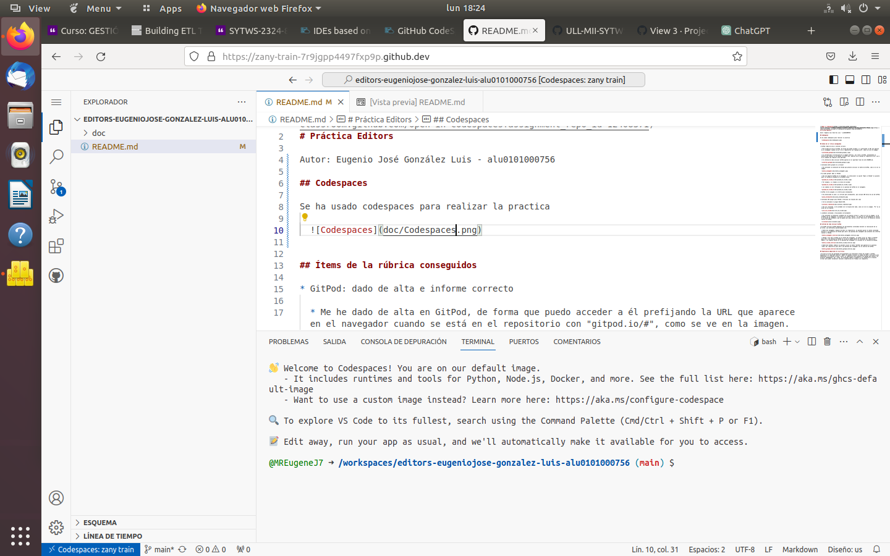
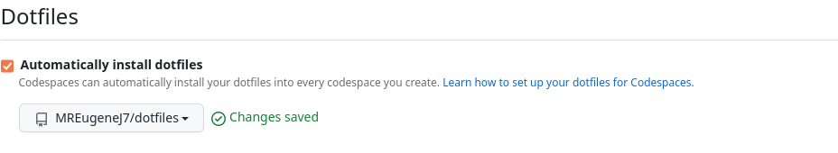
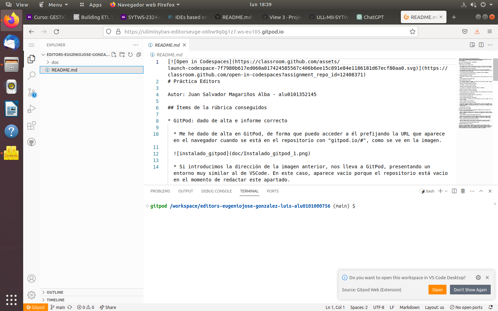
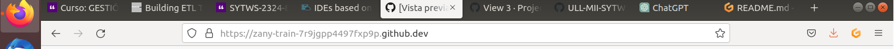
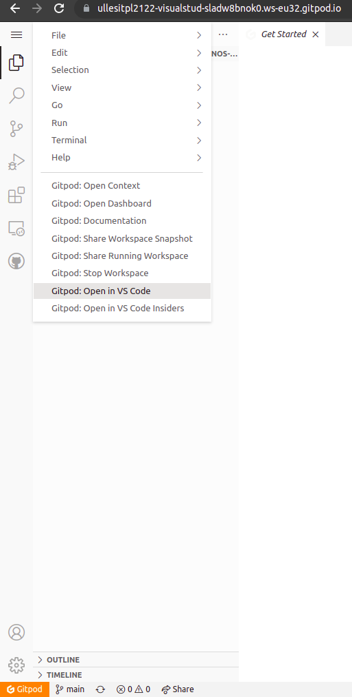
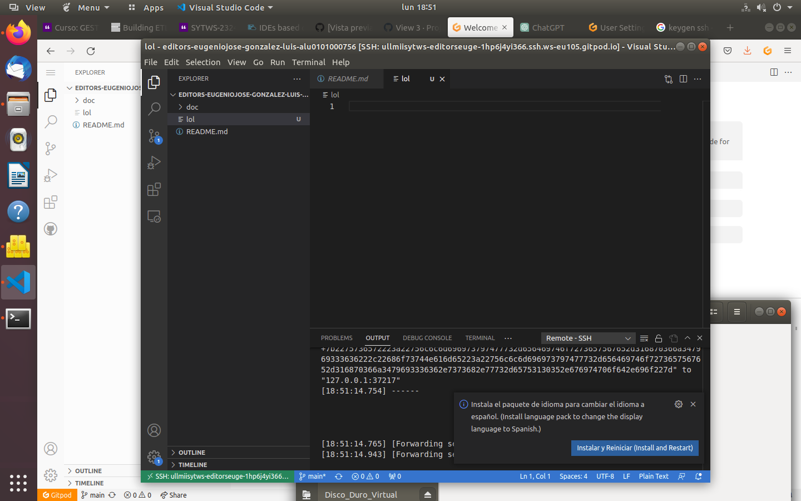
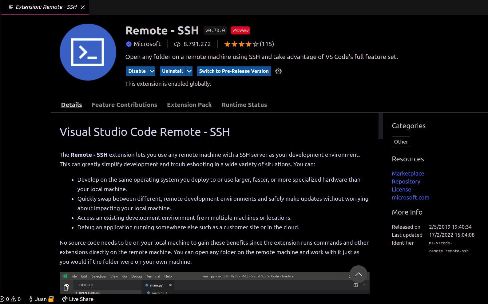
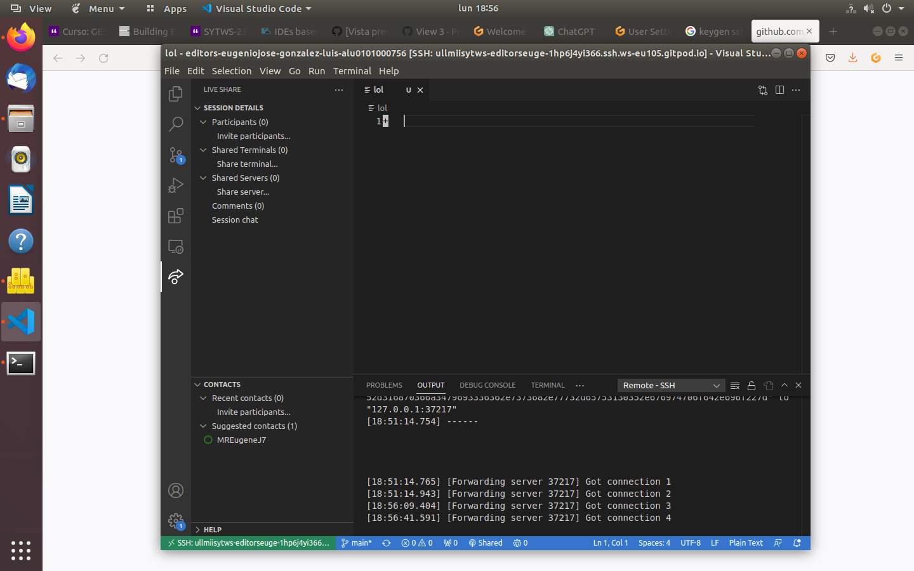

# Práctica Editors

Autor: Eugenio José González Luis - alu0101000756

## Codespaces

Se ha usado codespaces para realizar la practica

  

Estos codespaces estan personalizados con dotfiles contenidos en un repo.

  

## Ítems de la rúbrica conseguidos

* GitPod: dado de alta e informe correcto

  * Me he dado de alta en GitPod, de forma que puedo acceder a él prefijando la URL que aparece en el navegador cuando se está en el repositorio con "gitpod.io/#".

  * Si introducimos la dirección de la imagen anterior, nos lleva a GitPod, presentando un entorno muy similar al de Codespaces visto Anteriormente.

  

* Instalado botón gitpod en su browser

  * He instalado la extensión de Firefox que permite utilizar el botón de GitPod, como se ve en la imagen.

  

* Ha usado gitpod: Open in VSCode

  * Una vez abierto GitPod en el navegador, al seleccionar la opción "Open in VSCode" es posible abrir el GitPod en VSCode en la máquina local.

  

  * Por ejemplo, si creamos un archivo de prueba automaticamente se crea en gitpod:

  

* Instalado SSH plugin para VSCode y funciona con máquina del iaas

  * Se ha instalado el plugin Remote-SSH.

  

  * En la imagen del ejemplo de uso de gitpod se puede apreciar que esta conectado a gitpod mediante ssh.

* LiveShare instalado y funcionando correctamente

  * He instalado la extensión LiveShare en la máquina virtual y, como se ve en la imagen, lo he probado con un compañero. Al pulsar en el botón "Share", se copia en el portapapeles el enlace a la sesión de LiveShare, que se puede usar para unirse a ella. Para ello, es necesario iniciar sesión en GitHub.

  
